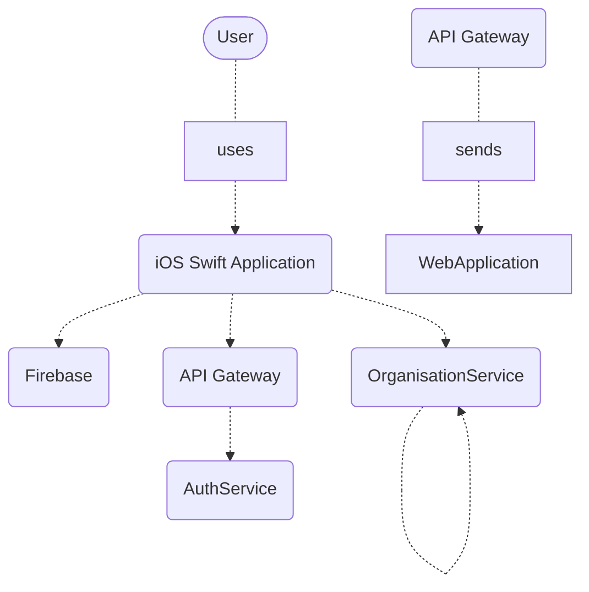
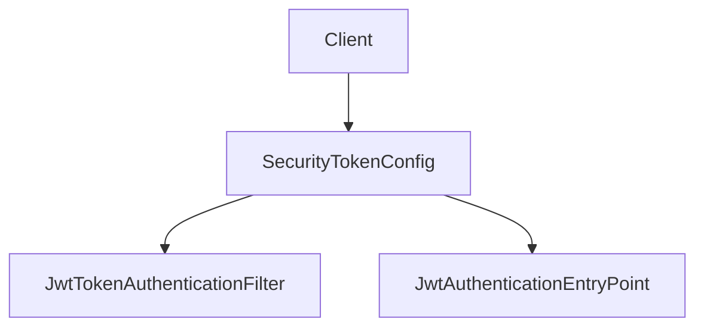
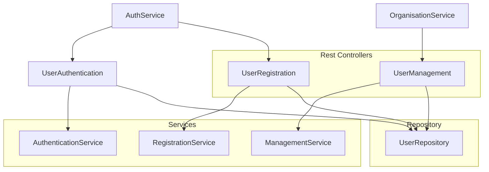
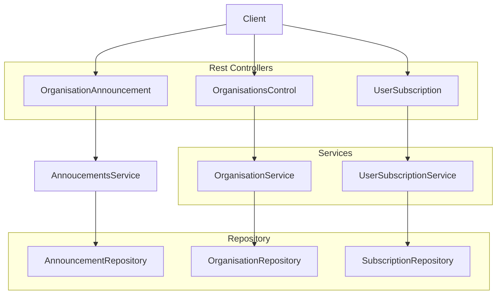

# onTop application

## Technologies
- Java Sping Boot Microservices _(backend)_
- iOS Mobile App _(frontend)_
- Firebase _(external service)_
- Zuul Load Balancer
- Feign Client
- Maven Local _(for API releases)_
- JWT authentication
- Docker

## Service-Oriented Architecture patterns
- REST services
- API Gateway pattern
- Spring Boot Microservices Architecture
- JWT authentication and access
- Database integrated in Docker (MariaDB)

## Functionalities
- Login using phone number (firebase)
- Select organisation of interest.
- Subscribe/Unsubscribe from organisation
- Read News

## Run the applications
Run every microservice, especially RegistryServer, ApiGateway and AuthServer
Note: The server can be started in Docker with `docker-compose up`.

## API

### API Gateway Server
- All requests must be sent to the API Gateway Port 
- The server will ask AuthServer for every request token, and will reject the invalid ones.

### AuthServer
- AuthServer will generate Tokens using a firebaseToken (from phone auth) that will be checked in order to validate the request
- A Feight Client of UserServer will help in case a user already exists with the phoneNumber.   
- POST "/api/tokens" - to request a token using firebaseToken.
- DELETE "/api/tokens" - to tell the AuthServer to delete the client tokens.

### UserService
- GET "user/authentication/users" - getAll users
- GET "user/authentication/user" - find if nickname is already in use
- POST "user/management/v1/findByPhone" - find user by phone
- POST "user/management/v1/find" - get userinfo by name
- POST "user/management/v1/get-name" - get nickname for userId
- POST "user/management/v1/name-availability" - find if nickname is already in use
- POST "user/registration/v1/register" - register new user

### OrganisationService
- GET "organisation/organisations/v1/getByUserId" - get organisations for userId 
- GET "organisation/organisations/v1/getAllSortedByPopularity" - get organisations sorted for userId
- PUT "organisation/subscription/v1" - add subscription by id for userid
- DELETE "organisation/subscription/v1" - delete subscription by id for userid
- POST "organisation/subscription/v1/getUserSubscriptions" - get subscriptions by userId
- POST "organisation/announcement/v1/publish" - publish announcement for organisation
- GET "organisation/announcement/v1/getByOrganisationId" - get annoucements for organisation
- GET "organisation/announcement/v1/getByUserId" - get annoucements for userid

## Diagrams

Level 1:
### System diagram


Level 2:
### Container diagram
```mermaid
graph TD
    MobileApplication-->Firebase
    MobileApplication-->API Gateway
    API Gateway-->AuthService
    AuthService-->Firebase
    API Gateway-->UserService
    API Gateway-->OrganisationService
```

Level 3:
### Component diagram (of API Gateway)


### Component diagram (of AuthService)
```mermaid
graph TD
    API Gateway-->SecurityCredentialsConfig
    SecurityCredentialsConfig-->JWTAuthenticationFilter
    JWTAuthenticationFilter-->TokenGenerator
    JWTAuthenticationFilter-->AuthTokensPairService 
    JWTAuthenticationFilter-->AuthenticationManager
    JWTAuthenticationFilter-->UserService
    UserService-->UserManagementProxy
    UserService-->UserRegisteryProxy
```

### Component diagram (of UserService)


### Component diagram (of OrganisationService)


Level 4:
### Code diagram

```mermaid
classDiagram
UserService Microservice
    class UserPublicDetails {
        + id: number
        + nickName: string
    }
    class UserVo {
        + id: number
        + name: string
        + phoneNumber: string
    }
    
    class UserAuthentication{
        - authenticationService: AuthenticationService
        + getAll()
        + getUser()
    }
    class UserAuthentication{
        - authenticationService: AuthenticationService
        + getAll()
        + getUser()
    }
    class UserManagement{
        - managementService: ManagementService
        + findUsersByPhone()
        + findUsersByName()
        + findNameById()
    }
    class UserRegistration{
        - registrationService: RegistrationService
        + register()
    }
    
AuthService Microservice
    AuthController
    
    class RefreshTokenVo {
        + authToken: string
        + refreshToken: string
    }
    
    class AuthController{
        - authTokensPairService: AuthTokensPairService
        + getAll()
        + getUser()
    }
    
    class SecurityCredentialsConfig {
        - userDetailsService: UserDetailsService
        - userService: UserService
        - tokenGenerator: TokenGenerator
        - AauthTokensPairService: AuthTokensPairService
        + configure()
    }
    SecurityCredentialsConfig --> JWTAuthenticationFilter
    
    class JWTAuthenticationFilter{
        - userDetailsService: UserDetailsService
        - userService: UserService
        - tokenGenerator: TokenGenerator
        - AauthTokensPairService: AuthTokensPairService
        + attemptAuthentication()
        + successfulAuthentication()
    }
    
    class TokenGenerator{
        - authKeySecret: string
        - refreshKeySecret: string
        + generateToken()
    }
    
    class UserServiceImpl{
        - userRegistrationProxy: UserRegistrationProxy;
        - userManagementProxy: UserManagementProxy;
        + loadUserByUsername()
        + findUserByPhoneNumber()
        + createUser()
    }
```
